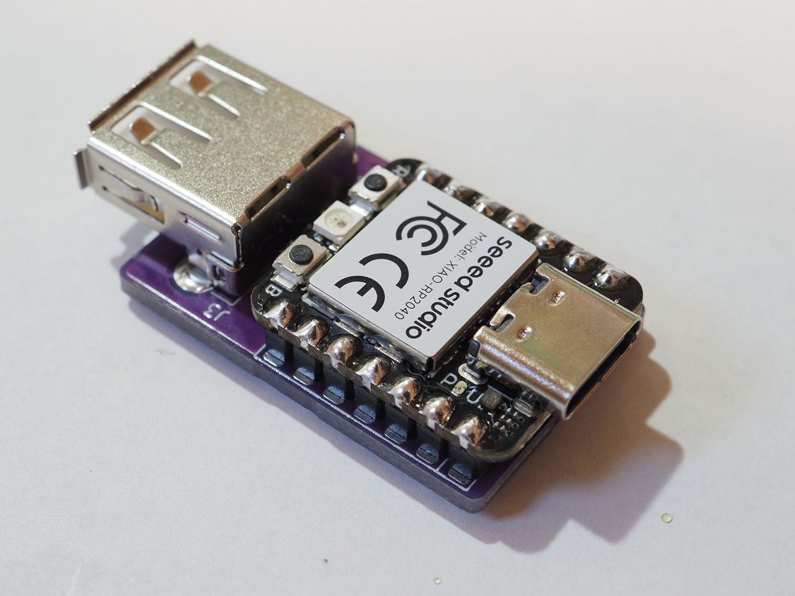
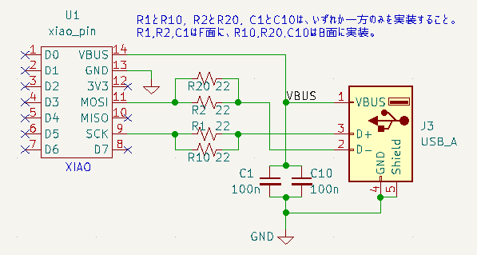
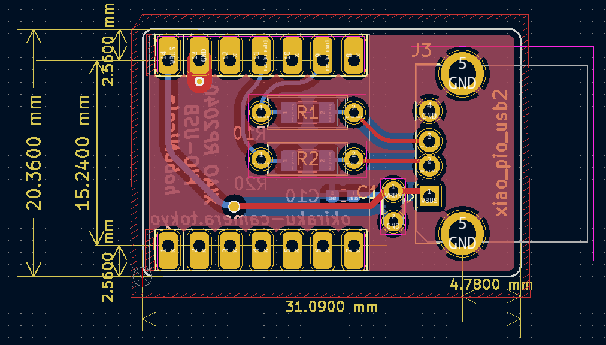
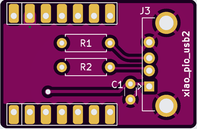
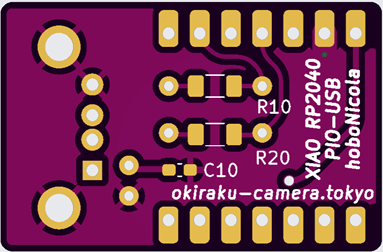
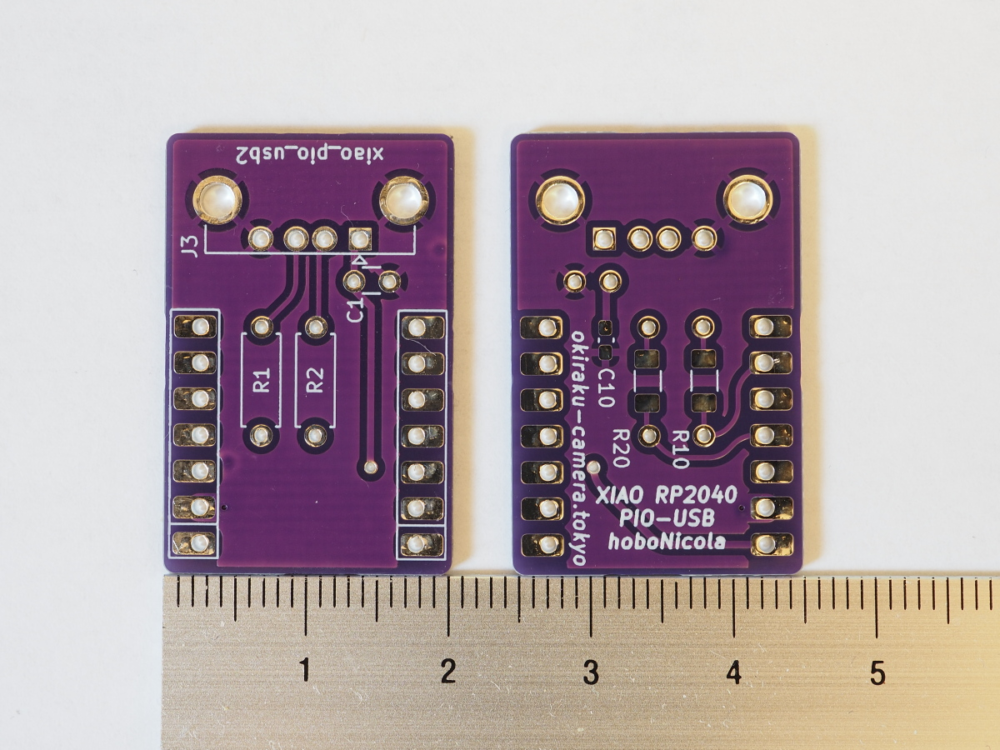

# XIAO RP2040 PIO-USB hoboNicola Adapter (xiao_pio_usb2)

## 概要
このリポジトリは、Seeed Studio **XIAO RP2040** と **pico-pio-usb** ライブラリを用いて
**hoboNicolaアダプター** を構成するためのPCBを設計するKiCAD 6.11用ファイルを提供します。
このPCBに XIAO RP2040、USB Type-Aコネクタ、抵抗・コンデンサを実装することで、市販のUSBキーボードを ほぼ**NICOLAキーボード** として利用できる変換アダプターを作成できます。

This project provides KiCad 6.11 PCB design files for building a hoboNicola adapter using the Seeed Studio XIAO RP2040 and the pico-pio-usb library.  
By assembling the XIAO, a USB Type-A receptacle, and a few passives, you can convert a standard USB keyboard into an almost-NICOLA (thumb-shift) keyboard.  
The adapter receives HID input as a USB host, processes it with the hoboNicola firmware, and outputs transformed HID reports to the connected PC.

## hoboNicolaアダプターとは
hoboNicolaアダプターは、ふつうキーボードをほぼNICOLAキーボード (親指シフトキーボード) のように使うためのハードウェアです。

*rp_hobo_nicola (pio-usb-hoboNicola) アダプター*

- RP2040をUSBホストとして動作させ、キーボード入力(HIDレポート)を受信  
- hoboNicolaライブラリで入力を変換・処理  
- PCなどのUSBホストに対してHIDレポートを送信  
- ファームウェアにより親指シフトキーボードと同様の同時打鍵処理や配列を実現

ファームウェアとして、Arduino用プログラムの[hoboNicolaライブラリ](https://github.com/okiraku-camera/hoboNicolaLibrary) を使います。メインスケッチとしては `examples/rp_hobo_nicola/rp_hobo_nicola.ino` を選択してください。

## 回路概要
pico-pio-usbライブラリ使ってUSBHostを実現するため、RP2040のGPIOを以下のようにデバイス用のUSBコネクタに接続します。
- **GPIO2 (SCK)** → USB D+  
- **GPIO3 (MOSI)** → USB D-

(ファームウェア側の変更により、使用するGPIOも変更可能)  

- USBラインには 22Ω抵抗 (R1/R10, R2/R20) を挿入  
- デカップリングコンデンサ (C1/C10) は省略してもよい。

## PCB上のパターン
以下のパターンを用意しています。
- XIAO RP2040用 (スルーホール7ピン ×2)  
  - XIAO用のシンボルとフットプリントは `xiao_lib/xiao_lib.kicad_sym`,  `xiao_lib/xiao_pin.kicad_mod` として格納。
- 抵抗2本
  - F面にスルーホール用 (6.3mm長)、B面にSMD用 (3216サイズ)
- コンデンサ1本 (省略可)  
  - F面にスルーホール用 (ピン間2.5mm)、B面にSMD用 (1608サイズ)
- USB 2.0 Type-A コネクタ (レセプタクル)  

## 材料リスト
- PCB: XIAO RP2040 PIO-USB hoboNicola (xiao_pio_usb2)  
- Seeed Studio XIAO RP2040 (ピンヘッダ無し)
- USB 2.0 Type-A レセプタクル  
- 22Ω抵抗 ×2 (スルーホールまたはSMD)  
- 0.1uF 積層セラミックコンデンサ ×1 (省略可)  
- XIAO用ピンヘッダ 7ピン ×2  
- 熱収縮チューブ (スミチューブ A20C)  

### 実装オプション
スルーホール部品のみでも作成できるし、SMD部品を使うこともできます。
- **スルーホール部品**
  - スルーホール用の金属皮膜抵抗や積層セラミックコンデンサをF面に取り付ける。  
  - XIAOにピンヘッダを取り付け、F面に実装する。抵抗はXIAOの下に隠れるのでピンヘッダの高さに注意が必要。
  - 小型金属皮膜抵抗は長さ6.3mmで直径は約2.3mm、超小型ならば長さ3.3mmで直径1.8mm。用いる抵抗の大きさに応じたピンヘッダを選択すること。
   
- **SMD部品 (R10,R20,C10)**  
  - 表面実装用の抵抗やコンデンサをB面に実装する。
  - この場合、F面に他のパーツはないのでXIAOをPCBに面実装してもよい。  

最終的に、内径20mmのスミチューブ (A20C) に全体をかぶせ、ホットエアガンなどで収縮させてPCBやXIAOを保護します。XIAO上のRESETやBSELなどのスイッチは、チューブの上からも押すことができます。

### PCBの製造について
- `gerber_jlc` ディレクトリは、実際に[JLCPCB](https://jlcpcb.com/ ) に製造依頼したときのガーバーファイルおよびドリルファイルを含んでいます。 
- 以下は製造依頼時のガーバー表示です。

- 製造用ファイルを出力するときに KiCadに設定する各種パラメータは JLCPCB のサイト内を参照してください。発注時の製造パラメータなどについても同様。

### PCB 完成図

## 注意事項
> **重要**  
> This KiCad PCB project is provided **"AS IS"**, without warranty of any kind.  
> 作者は本データの正確性や適合性について責任を負いません。  
> Use at your own risk.

> このプロジェクトは KiCad 6.11 専用です。  
> 他のバージョンでは正しく動作しない可能性があります。

## ライセンス
このプロジェクトは **CERN Open Hardware Licence Version 2 - Permissive** のもとで公開されています。  
詳細は [LICENSE](./LICENSE) ファイルを参照してください。